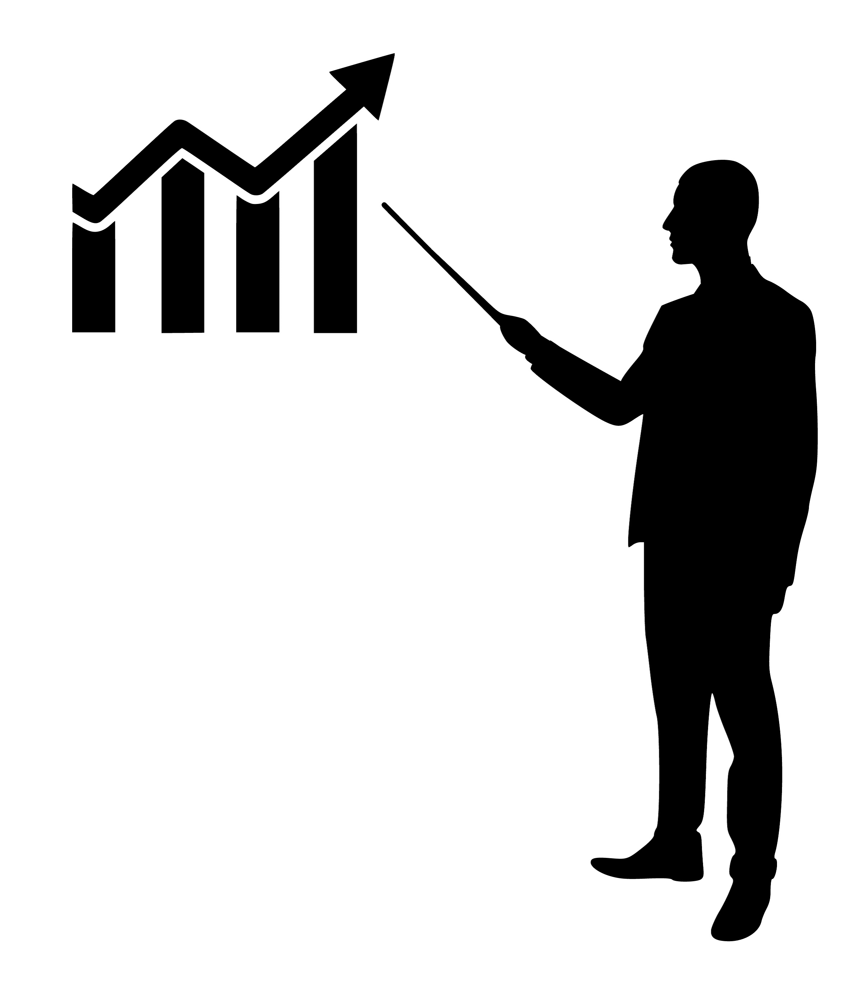

---
output:
  html_document:
    toc: no
    toc_depth: 1
    toc_float:
      collapsed: yes
    theme: readable
  pdf_document:
    toc: yes
    toc_depth: '1'
colorlinks: yes
urlcolor: blue
linkcolor: blue
citecolor: blue
anchorcolor: blue
toccolor: blue
fontsize: 12pt
---

<div align="center">

# Google Data Analytics Certificate Capstone Project
### Case Study: How Can Cyclistic Bike-Share Company Navigate Speedy Success?
 By Sotaire Kwizera  
 Last Updated: `r format(Sys.time(), "%m-%d-%Y at %I:%M %p")`

</div>


```{r General setup, echo = F}
knitr::opts_chunk$set(echo = F,include=T, comment=F, warning = F, message = F )
```

```{r Load packages, }
library(tidyverse)
library(readxl)
library(mice)
library(lubridate)
library(leaflet)
library(plotly)
library(ggeasy)
library(viridis)
library(gridExtra)
library(patchwork)
library(htmltools)
library(manipulateWidget)
library(rsconnect)
library(shiny)
```


```{r Load dataset}
cyclistic_data <- read_excel("google_cap/Divvy_Trips_2019_Q2.xlsx")

cyclistic_data_Geo<- read_excel("google_cap/Divvy_Trips_2020_Q1.xlsx")

X202008_divvy_tripdata <- read_excel("google_cap/202310-divvy-tripdata.xlsx")

# This dataset has critical geographic data for all bike station locations
# And it Covid-19 period. Might tell us something about the rider's behavior during hard times(unstable economy)
# My gut feeling is that people bike more during this time.We shall find out!

```


```{r Data Processing }
# datetime variables manipulations 

cyclistic_data_clean1 <- cyclistic_data %>%
  mutate(start_local_time = 
           `01 - Rental Details Local Start Time`) %>% 
  mutate(end_local_time = 
           `01 - Rental Details Local End Time`) %>% 
  mutate(ride_length = 
           sprintf("%02d:%02d:%02d", 
                   hour(seconds_to_period(`01 - Rental Details Duration In Seconds Uncapped`)), 
                   minute(seconds_to_period(`01 - Rental Details Duration In Seconds Uncapped`)), 
                   second(seconds_to_period(`01 - Rental Details Duration In Seconds Uncapped`))))


cyclistic_data_clean <- cyclistic_data_clean1 %>% 
  mutate(num.ride_length = as.numeric(sapply(strsplit(cyclistic_data_clean1$ride_length, ":"), 
                                             function(x) {
                           as.numeric(x[1]) * 3600 + as.numeric(x[2]) * 60 +
                           as.numeric(x[3])
                                                         }))) %>% 
  mutate(day_of_week = 
           weekdays(start_local_time))

#md_pattern2 <- md.pattern(cyclistic_data_clean)  # 4362 obs.(riders) miss data for gender 
                                                 # 1 rider miss data on birth year 
                                                 # 165107 riders miss data for both gender and birth year
#write.csv(cyclistic_data_clean, file = "cyclistic_data_clean.csv", row.names = TRUE)

# 2020 dataset

cyclistic_data_Geo_clean1 <- cyclistic_data_Geo %>%
  filter(!is.na(end_lng)) %>% 
  mutate(start_local_time = 
           with_tz(started_at, "America/Chicago")) %>% 
  mutate(end_local_time = 
           with_tz(ended_at, "America/Chicago")) %>% 
  mutate(ride_length = 
           sprintf("%02d:%02d:%02d", 
                   hour(seconds_to_period(ended_at - started_at)), 
                   minute(seconds_to_period(ended_at - started_at)), 
                   second(seconds_to_period(ended_at - started_at))))

 
cyclistic_data_Geo_clean <- cyclistic_data_Geo_clean1 %>% 
  mutate(num.ride_length = 
           as.numeric(sapply(
             strsplit(cyclistic_data_Geo_clean1$ride_length, ":"), 
             function(x) {
           as.numeric(x[1]) * 3600 + as.numeric(x[2]) * 60 + as.numeric(x[3])
                         }))) %>%  
  filter(num.ride_length>=0) %>% 
  mutate(day_of_week = 
           weekdays(start_local_time))

#md_pattern <- md.pattern(cyclistic_data_Geo_clean)  # 1 rider missing end_station name, id, lat, and lng (aka stolen bike!!!)

#write.csv(cyclistic_data_Geo_clean, file = "cyclistic_data_Geo_clean.csv", row.names = TRUE)
                                                 
```


# I. Background 

<figure style="overflow: auto; float: right; margin-left: 5px;">
  
<figcaption style="text-align: left; font-style: italic;"></figcaption>
</figure>

<p style="text-align: left;">Cyclistic is a fictitious bike-share company based in Chicago, I am undertaking a project that could significantly influence this company’s future. Cyclistic has been a success since its launch in 2016, growing to a fleet of 5,824 geotracked bicycles locked into a network of 692 stations across Chicago. The bikes can be unlocked from one station and returned to any other station in the system anytime.</p>

<figure style="overflow: auto; float: left; margin-right: 5px;">
  

<figcaption style="text-align: left; font-style: italic;">Chicago's Greatest Hits Bicycle Tour <br> with Bobby's Bike Hike in Chicago, IL <br> Source: [tripster.com](https://www.tripster.com/) </figcaption>
</figure>

 <p style="text-align: left;">Chicago, once named the best bicycling city in the nation by Bicycling Magazine, has seen a surge in cycling popularity over the last decade. The city is well-equipped for cyclists, with almost every street featuring either a shared or buffered bike lane. Cyclistic’s bike-share program aligns perfectly with this culture, offering over 580 stations and 5,800 bikes across the city. The city hosts several cycling events, including the annual Bike the Drive event, which sees Lake Shore Drive closed to vehicular traffic, transforming it into a cyclist’s paradise.</p>


  
# II. Goals and Objectives
<figure style="overflow: auto; float: right; margin-left: 5px;">
  
<figcaption style="text-align: left; font-style: italic;"> Author: Mohamed Hassan </figcaption>
</figure>
  

<p style="text-align: left;">Cyclistic’s marketing strategy has so far focused on building general awareness and appealing to broad consumer segments. The company achieved this through the flexibile pricing plans: single-ride passes, full-day passes, and annual memberships. Customers who purchase single-ride or full-day passes are referred to as customers, while those who purchase annual memberships are Cyclistic subscribers.</p>

<p style="text-align: left;">Although the pricing flexibility helps the company attracts more customers, Moreno, Cyclistic’s  marketing director, believes that maximizing the number of annual members will be key to the company’s future growth. Rather than creating a marketing campaign that targets all-new customers, Moreno sees a solid opportunity to convert casual riders into members.</p>

<p style="text-align: left;">Moreno has set a clear goal for me: Design marketing strategies aimed at converting casual riders into annual members. To do this, however, we need to better understand How do annual members and casual riders use Cyclistic bikes differently, why casual riders would buy a membership, and how digital media could affect our marketing tactics. In this preliminary analysis, I will use Cyclistic’s historical bike trip data to answer the first question.</p>


# III. Data & Data Processing 

<p style="text-align: left;">The data utilized for this case study was sourced from Cyclistic’s bike trip records for the first quarter of 2019. To facilitate a comprehensive spatial analysis, I supplemented the 2019 data with recent data from 2023, which includes geographic coordinates for each of Cyclistic’s bike stations in Chicago. The datasets employed for this study are both appropriate and unbiased, lending credibility to the analysis. These datasets were generously provided by Motivate International Inc. under this [license](https://divvy-tripdata.s3.amazonaws.com/index.htm). Importantly, these datasets respect user privacy, as they do not contain any confidential or personally identifiable information such as the names, contact details, or payment methods of the riders.</p>

<p style="text-align: left;">The initial steps in processing the data involved renaming columns for easier reference within the R programming environment. Following this, I created a new column to represent the day of the week when each trip commenced. Subsequently, I extracted the “time” data from the columns containing “datetime” information about the start and end of each customer trip. This allowed me to create a new column indicating the length (in minutes) of each trip taken.</p>

<p style="text-align: left;">Finally, for the sake of simplicity and to facilitate statistical analysis, I converted the data in the trip length column to minutes. This comprehensive and meticulous data processing approach ensures the accuracy and reliability of the subsequent analysis.</p>

# IV. Descriptive Statistics 

<figure style="overflow: auto; float: left; margin-right: 5px;">
```{r counts graphs: 1-3, echo=FALSE, fig.width=5, fig.height=4}

#graph #1 trips count by customer_type

# Total customer (sample size): 1 048 575


cust_distr <- cyclistic_data_clean %>%
  select(Trip_id = `01 - Rental Details Rental ID`, customer_type = `User Type`) %>% 
  count(customer_type) %>% 
  mutate(percentage = round(n / sum(n) * 100, 2))

pie_chart <- plot_ly(
  data = cust_distr,
  labels = ~customer_type,
  values = ~percentage,
  type = "pie",
  hoverinfo = "text",
  marker = list(colors = c("yellow", "lightgreen")) 
) %>%
layout(
  title = list(
    text = "Distribution of Customer Types",
    font = list(size = 20),
    y = 0.98
  ),
   margin = list(t = 60),
  showlegend = TRUE,
  legend = list(orientation = "h", x = 0.29, y = -0.1),
  xaxis = list(showgrid = FALSE, zeroline = FALSE, showticklabels = FALSE),
  yaxis = list(showgrid = FALSE, zeroline = FALSE, showticklabels = FALSE)
)

pie_chart

```

  <figcaption style="text-align: left; font-style: italic;">Figure 1: The majority of Cyclistic bike users are subscribers</figcaption>
</figure>

<p style="text-align: left;">Cyclistic 2019 dataset contains a total of 1,048,575 trips of which only 22.5% were taken by customers or casual as shown on figure 1 on the left. The overall average ride length was 19.7 minutes, while customers and subscribers had an average of 41.5 and 13.4 minutes respectively. These statistics suggest that casual riders tend to take longer trips compared to their counterparts with annual membership with Cyclistic.</p>


# V. Data insights through visuals

<p style="text-align: left;">The cycling habits of Cyclistic bike users exhibit significant variations based on their membership status. Users can be broadly categorized into two groups: casual customers who do not have a membership, and subscribers who hold an annual membership.</p>

<p style="text-align: left;">As depicted in the following figure, figure 2, which represents the percentage of trips undertaken by customers and subscribers on each day of the week, a clear pattern emerges. Subscribers tend to take frequent trips throughout the day, every single day of the week, a behavior that is noticeably different from their non-member counterparts. For example, subscribers took 85.37% of all the rides that happened Wednesdays.</p>


<figure style="overflow: auto; float: right; margin-left: 5px;">

```{r Percentage of Trips, fig.width=8, fig.height=4 }
data <- data.frame(
   day_of_week= c("Sunday","Sunday", "Monday", "Monday", "Tuesday", "Tuesday",
                                         "Wednesday", "Wednesday", "Thursday", "Thursday", "Friday", "Friday","Saturday", "Saturday"), 
   User_Type = c("Customers", "Subscriber","Customers", "Subscriber", "Customers", "Subscriber", "Customers", "Subscriber", "Customers", "Subscriber", "Customers", "Subscriber", "Customers", "Subscriber" ),
   
   
   
  percentage = c(41.68, 58.32, 17.63, 82.37, 15.49, 84.51, 14.63, 85.37, 14.86, 85.14, 20.74, 79.26, 41.68, 58.32)  # Values for variable Var2
)

  
  
  data_level <- data %>% 
    mutate(day_of_week = factor(day_of_week,
                              levels = c("Sunday", "Monday", "Tuesday",
                                         "Wednesday", "Thursday", "Friday",
                                         "Saturday"))) 
  data_graph <-  ggplot(data_level, aes(x = day_of_week, y = percentage, fill = User_Type)) +
    geom_bar(position = "dodge", stat = "identity") +
    geom_text(aes(label = paste0(round(percentage, 2), "%")), position = position_dodge(width = 0.9), hjust = 1, size = 3) +
    labs(x = "Day of the Week", y = "Percentage of Trips", title = "Percentage of Trips Each Day of the Week") +
    theme_classic() +
    scale_fill_manual(values = c("Subscriber" = "lightgreen", "Customers" = "yellow")) +
    easy_y_axis_title_size(size = 15) +
    easy_x_axis_title_size(size = 15) +
    easy_plot_title_size(size = 16) +
    easy_center_title() +
    facet_grid(. ~ User_Type) +
    coord_flip()

data_graph


  #ggplotly(data_graph, tooltip = c("text"))
  


```

<figcaption style="text-align: left; font-style: italic;">Figure 2: Unlike Cyclistic Subscribers, <br> customer bike users take larger percentage of their trips <br> on weekends. .</figcaption>
</figure>

<p style="text-align: left;">Another intriguing observation from this graph is the distinct riding habits of customers and subscribers over the weekend and weekdays. Customers tend to ride more on Saturdays and Sundays, while subscribers are more active during the weekdays. This trend suggests that subscribers are more likely to use their bikes for commuting to work, while customers might be using the bikes more for leisure activities.</p>

<p style="text-align: left;">The subsequent graph, at the bottom shifts the focus to another aspect of user behavior: the length of the ride. The data suggests that customers tend to embark on longer rides, averaging up to 40 minutes Throughtout the week. In contrast, subscribers typically opt for shorter trips, averaging around 15 minutes. This difference in ride duration further underscores the divergent usage patterns between customers and subscribers, possibly reflecting their distinct needs and motivations for using the Cyclistic bike service.</p>

<figure style="overflow: auto; float: left; margin-right: 5px;">

```{r average ride time per day by user_type, echo=FALSE,  fig.width=8, fig.height=4}


 days <-  cyclistic_data_clean %>%
  select(Trip_id = `01 - Rental Details Rental ID`, `User Type`, day_of_week, ride_length) %>% 
  mutate(`Ride Length (in min)` = round(as.numeric(substr(ride_length, 1, 2)) * 60 + 
                                        as.numeric(substr(ride_length, 4, 5)) +
                                        as.numeric(substr(ride_length, 7, 8))/60, 2)) %>%
  group_by(day_of_week,`User Type` ) %>%
  summarize(avg_ride_length = round(mean(`Ride Length (in min)`), 2)) %>% 
  arrange(day_of_week) %>%   # Optionally sort by day_of_week
  mutate(day_of_week = factor(day_of_week,
                              levels = c("Sunday", "Monday", "Tuesday",
                                         "Wednesday", "Thursday", "Friday",
                                         "Saturday"))) 


   days_graph <-  ggplot(days, aes(x = day_of_week, y = avg_ride_length, fill = `User Type`)) +
    geom_bar(position = "dodge",stat = "identity",aes(text = paste0("User Type: ", `User Type`,"\n","Ride Length: ", avg_ride_length))) +
    geom_text(aes(label = paste0(round(avg_ride_length, 2), " min")), position = position_dodge(width = 0.9), hjust = 1, size = 3) +
    labs(x = "Day of the Week", y = "Trips length (in mins)", title = "Average Trip Length Each Day of the Week") +
    theme_classic() +
    scale_fill_manual(values = c("Subscriber" = "lightgreen", "Customer" = "yellow")) +
    easy_y_axis_title_size(size = 12)+
    easy_x_axis_title_size(size = 12)+
    easy_plot_title_size(size = 16)+
    easy_center_title() + 
    facet_grid(. ~ `User Type`) +
    coord_flip()
   
   days_graph
 
 #ggplotly(days_graph, tooltip = c("text"))
  
  


```

<figcaption style="text-align: left; font-style: italic;">Figure 3: Customer biker riders tend to take longer trips on average.</figcaption>
</figure>


 

<p style="text-align: left;">The following graph, figure 4, builds up on the idea that subscriber use Cyclistic bikes to commute to work. It illustrates the trend in the number of rides taken by subscribers at three-hour intervals throughout the day. Coincidentally the subscribers see their peak in the number of rides during the regular rush hours 6 to 8 am and 6 to 8 pm. This observation lends further evidence to the hypothesis that subscribers primarily use Cyclistic bikes for commuting to and from work.</p>


<figure style="overflow: auto; float: right; margin-left: 5px;">

```{r graph3: trip count by time segments, echo=FALSE,  fig.width=8, fig.height=4}
# rides by time segments)

`00 to 2` <- cyclistic_data_clean %>%
  select(`User Type`,start_local_time ) %>% 
  mutate(hour = lubridate::hour(start_local_time)  # Extracting hour component
          , day = lubridate::day(start_local_time),    # Extracting day component
          month = lubridate::month(start_local_time)) %>%  # Extracting month component
  filter(hour >= 0 & hour <= 2 ) %>% 
count(`User Type`) %>% 
  mutate(percentage = round(n / sum(n) * 100, 2))
 
  
  `3 to 5` <- cyclistic_data_clean %>%
    select(`User Type`,start_local_time ) %>%
  mutate(hour = lubridate::hour(start_local_time)  # Extracting hour component
          , day = lubridate::day(start_local_time),    # Extracting day component
          month = lubridate::month(start_local_time)) %>%  # Extracting month component
  filter(hour >= 3 & hour <= 5 ) %>% 
count(`User Type`) %>% 
  mutate(percentage = round(n / sum(n) * 100, 2))
  
  
 
  
  `6 to 8` <- cyclistic_data_clean %>%
    select(`User Type`,start_local_time ) %>%
  mutate(hour = lubridate::hour(start_local_time)  # Extracting hour component
          , day = lubridate::day(start_local_time),    # Extracting day component
          month = lubridate::month(start_local_time)) %>%  # Extracting month component
  filter(hour >= 7 & hour <= 9) %>% 
count(`User Type`) %>% 
  mutate(percentage = round(n / sum(n) * 100, 2))
 
  
  `9 to 11` <- cyclistic_data_clean %>%
    select(`User Type`,start_local_time ) %>%
  mutate(hour = lubridate::hour(start_local_time)  # Extracting hour component
          , day = lubridate::day(start_local_time),    # Extracting day component
          month = lubridate::month(start_local_time)) %>%  # Extracting month component
  filter(hour >= 9 & hour <= 11) %>% 
count(`User Type`) %>% 
  mutate(percentage = round(n / sum(n) * 100, 2))
 
  
  `12 to 14` <- cyclistic_data_clean %>%
    select(`User Type`,start_local_time ) %>%
  mutate(hour = lubridate::hour(start_local_time)  # Extracting hour component
          , day = lubridate::day(start_local_time),    # Extracting day component
          month = lubridate::month(start_local_time)) %>%  # Extracting month component
  filter(hour >= 12 & hour <= 14) %>% 
count(`User Type`) %>% 
  mutate(percentage = round(n / sum(n) * 100, 2))
  
  
  `15 to 17` <- cyclistic_data_clean %>%
    select(`User Type`,start_local_time ) %>%
  mutate(hour = lubridate::hour(start_local_time)  # Extracting hour component
          , day = lubridate::day(start_local_time),    # Extracting day component
          month = lubridate::month(start_local_time)) %>%  # Extracting month component
  filter(hour >= 15 & hour <= 17) %>% 
count(`User Type`) %>% 
  mutate(percentage = round(n / sum(n) * 100, 2))
  
  `18 to 20` <- cyclistic_data_clean %>%
    select(`User Type`,start_local_time ) %>%
  mutate(hour = lubridate::hour(start_local_time)  # Extracting hour component
          , day = lubridate::day(start_local_time),    # Extracting day component
          month = lubridate::month(start_local_time)) %>%  # Extracting month component
  filter(hour >= 18 & hour <= 20) %>% 
count(`User Type`) %>% 
  mutate(percentage = round(n / sum(n) * 100, 2))
  
  `21 to 23` <- cyclistic_data_clean %>%
    select(`User Type`,start_local_time ) %>%
  mutate(hour = lubridate::hour(start_local_time)  # Extracting hour component
          , day = lubridate::day(start_local_time),    # Extracting day component
          month = lubridate::month(start_local_time)) %>%  # Extracting month component
  filter(hour >= 21 & hour <= 23) %>% 
count(`User Type`) %>% 
  mutate(percentage = round(n / sum(n) * 100, 2))
  
    

combined_results <- bind_rows(
  `00 to 2` %>% mutate(Time_Segment = "00 to 2"),
  `3 to 5` %>% mutate(Time_Segment = "3 to 5"),
  `6 to 8` %>% mutate(Time_Segment = "6 to 8"),
  `9 to 11` %>% mutate(Time_Segment = "9 to 11"),
  `12 to 14` %>% mutate(Time_Segment = "12 to 14"),
  `15 to 17` %>% mutate(Time_Segment = "15 to 17"),
  `18 to 20` %>% mutate(Time_Segment = "18 to 20"),
  `21 to 23` %>% mutate(Time_Segment = "21 to 23")
) %>%
  arrange(`User Type`, desc(percentage))

# Set the order of Time_Segment as a factor
combined_results$Time_Segment <- factor(combined_results$Time_Segment,
                                        levels = c("00 to 2", "3 to 5", "6 to 8",
                                                   "9 to 11", "12 to 14", "15 to 17",
                                                   "18 to 20", "21 to 23"))

# Plot with ordered Time_Segment
day_times <- ggplot(combined_results, aes(x = Time_Segment, y = percentage, fill = `User Type`)) +
  geom_bar(position = "dodge",stat = "identity",aes(text = paste0("Time of the day: ", Time_Segment,"\n","Percentage: ", percentage))) +
  geom_text(aes(label = paste0(round(percentage, 2), "%")), position = position_dodge(width = 1), vjust = 1.5, size = 2) +
  geom_line(aes(group = `User Type`)) +  # Line for each category
  labs(x = "Time segment", y = "Percentage of Trips", title = "Percentage of Trips at Every 3 hours") +
  theme_classic()+
  scale_fill_manual(values = c("Subscriber" = "lightgreen", "Customer" = "yellow")) +
  easy_y_axis_title_size(size = 12)+
  easy_x_axis_title_size(size = 12)+
  easy_plot_title_size(size = 13)+
  easy_center_title()+
  theme(axis.text.x = element_text(angle = 45, hjust = 1))

day_times
 #ggplotly(day_times, tooltip = c("text"))


```


  <figcaption style="text-align: left; font-style: italic;"> Figure 4: Subscribers see their peak in the number of rides <br> during the regular rush hours 6 to 8 am and 6 to 8 pm.</figcaption>
</figure>

<p style="text-align: left;">Leveraging the available data for the starting and ending stations of each trip, I conducted an aggregate analysis to rank all the routes utilized by Cyclistic bike users. The results revealed the top five most frequented routes, which are as follows:
</p>

* 1st route: Lake Shore Dr & Monroe St to Streeter Dr & Grand Ave, with a total of 2872 trips.
* 2 nd route: A round trip from Lake Shore Dr & Monroe St back to the same location, with 2720 trips.
* 3rd route: A round trip from Streeter Dr & Grand Ave back to the same location, with 2452 trips.
* 4th route: A round trip from Michigan Ave & Oak St back to the same location, with 1405 trips.
* 5th route: A round trip from Montrose Harbor back to the same location, with 1106 trips.

<p style="text-align: left;">Figure 5 provides a distribution of these trips among customers and subscribers. Interestingly, these most used routes are predominantly used by customer riders, with over 94 percent of customers using the first route. 

<p style="text-align: left;"> This finding is particularly surprising and suggests that these routes may be popular for leisurely rides or tourist activities. In fact, Streeter Dr. & Grand Ave. is near a very popular pier in Chicago and a Museum, suggesting that people use the bikes for fun and to get to and between points of interest. Lake Shore Dr. & Monroe St. and Lake Shore Dr. & North Blvd. are also near Grant Park which is a great place to go bike riding. It also underscores the importance of understanding the different usage patterns of customers and subscribers, as this information can guide Cyclistic’s strategic planning, resource allocation, advatisement campains aimed at convering customers into subscribers. For instance, ensuring adequate bike availability on these popular routes could enhance the riding experience for customers and potentially convert them into annual subscribers.
</p>
 


```{r routes}
routes_data <- cyclistic_data_clean %>% 
 select(trip_id = `01 - Rental Details Rental ID`, 
        start_station = `03 - Rental Start Station Name`, 
        end_station = `02 - Rental End Station Name`,
        `User Type`) %>%
  mutate(routes = paste(start_station, end_station, sep = " ==> "))

sum_routes <- routes_data %>% 
 group_by(routes) %>% 
count(routes) %>% 
  arrange(-n) %>% 
  filter(n>1100)

route_user <- routes_data %>% 
  filter(routes == 
           c("Lake Shore Dr & Monroe St ==> Streeter Dr & Grand Ave", 
             "Lake Shore Dr & Monroe St ==> Lake Shore Dr & Monroe St",
             "Streeter Dr & Grand Ave ==> Streeter Dr & Grand Ave",
              "Michigan Ave & Oak St ==> Michigan Ave & Oak St",
              "Montrose Harbor ==> Montrose Harbor"
             )) %>% 
  mutate(routes = case_when(
    routes == "Lake Shore Dr & Monroe St ==> Streeter Dr & Grand Ave" ~ "1st Route",
    routes == "Lake Shore Dr & Monroe St ==> Lake Shore Dr & Monroe St" ~ "2nd Route",
    routes == "Streeter Dr & Grand Ave ==> Streeter Dr & Grand Ave" ~ "3rd Route",
    routes == "Michigan Ave & Oak St ==> Michigan Ave & Oak St" ~ "4th Route",
    routes == "Montrose Harbor ==> Montrose Harbor" ~ "5th Route"
    
  )) %>% 
  count(routes, `User Type`)


```


<figure style="overflow: auto; float: right; margin-left: 5px;">

```{r Percentage of Trips by popular routes, fig.width=8, fig.height=4 }
data2 <- data.frame(
  route = c("2nd Route", "2nd Route", "1st Route", "1st Route", "4th Route", "4th Route",
            "5th Route", "5th Route", "3rd Route", "3rd Route"),
  User_Type = c("Customers", "Subscriber", "Customers", "Subscriber", "Customers", "Subscriber", "Customers", "Subscriber", "Customers", "Subscriber"),
  percentage = c(95, 5, 94.2, 5.8, 90.3, 9.7, 87.5, 12.5, 92.6, 7.4)
)

data_graph2 <- ggplot(data2, aes(x = route, y = percentage, fill = User_Type)) +
  geom_bar(position = "dodge", stat = "identity", aes(text = paste0("route: ", route, "\n", "Percentage: ", percentage))) +
  geom_text(aes(label = paste0(round(percentage, 2), "%")), position = position_dodge(width = 1), hjust = 1, size = 3) +
  labs(x = "Routes", y = "Percentage of Trips", title = "Percentage of Trips for the 5 Most Popular Routes") +
  theme_classic() +
  scale_fill_manual(values = c("Subscriber" = "lightgreen", "Customers" = "yellow")) +
  facet_grid(. ~ User_Type) +
  theme(axis.text.x = element_text(angle = 45, hjust = 1)) +
  coord_flip()
data_graph2
#ggplotly(data_graph2, tooltip = c("text"))

```

<figcaption style="text-align: left; font-style: italic;"> Figure 5:Lake Shore Dr & Monroe St to Streeter Dr & Grand Ave <br> is the most used route</figcaption>
</figure>

<p style="text-align: left;">Further dissecting  the distribution of trip by riders' age and gender (Figure 6), we discover that a substantial portion of customer riders falls within the 21 to 30-year-old bracket. Additionally, an overwhelming majority (97%) of riders who did not disclose their gender are categorized as customer riders. This demographic revelation underscores the importance of customizing services and incentives tailored specifically to this age group. Aligning Cyclistic's offerings more closely with the preferences and needs of this demographic holds immense value.</p>

<figure style="overflow: auto; margin: 0 auto; display: block; margin-right: 5px;width: 700px; height: 700px;">

```{r fig.width= 10, fig.height=7 }

`< 10 Y.O.` <- cyclistic_data_clean %>%
  select(Trip_id = `01 - Rental Details Rental ID`,`User Type`, "Rider_Age" =`05 - Member Details Member Birthday Year` ) %>%
  drop_na() %>% 
  filter(Rider_Age >= 2014) %>% 
count(`User Type`) %>% 
  mutate(percentage = round(n / sum(n) * 100, 2))
 
`11 to 20 Y.O.` <- cyclistic_data_clean %>%
  select(Trip_id = `01 - Rental Details Rental ID`,`User Type`, "Rider_Age" =`05 - Member Details Member Birthday Year` ) %>%
  drop_na() %>% 
  filter(Rider_Age >= 2004 & Rider_Age < 2014) %>% 
count(`User Type`) %>% 
  mutate(percentage = round(n / sum(n) * 100, 2))

`21 to 30 Y.O.` <- cyclistic_data_clean %>%
  select(Trip_id = `01 - Rental Details Rental ID`,`User Type`, "Rider_Age" =`05 - Member Details Member Birthday Year` ) %>%
  drop_na() %>% 
  filter(Rider_Age >= 1994 & Rider_Age < 2004) %>% 
count(`User Type`) %>% 
  mutate(percentage = round(n / sum(n) * 100, 2))

`31 to 40 Y.O.` <- cyclistic_data_clean %>%
  select(Trip_id = `01 - Rental Details Rental ID`,`User Type`, "Rider_Age" =`05 - Member Details Member Birthday Year` ) %>%
  drop_na() %>% 
  filter(Rider_Age >= 1984 & Rider_Age < 1994) %>% 
count(`User Type`) %>% 
  mutate(percentage = round(n / sum(n) * 100, 2))

`41 to 50 Y.O.` <- cyclistic_data_clean %>%
  select(Trip_id = `01 - Rental Details Rental ID`,`User Type`, "Rider_Age" =`05 - Member Details Member Birthday Year` ) %>%
  drop_na() %>% 
  filter(Rider_Age >= 1974 & Rider_Age < 1984) %>% 
count(`User Type`) %>% 
  mutate(percentage = round(n / sum(n) * 100, 2))

`51 to 60 Y.O.` <- cyclistic_data_clean %>%
  select(Trip_id = `01 - Rental Details Rental ID`,`User Type`, "Rider_Age" =`05 - Member Details Member Birthday Year` ) %>%
  drop_na() %>% 
  filter(Rider_Age >= 1964 & Rider_Age < 1974) %>% 
count(`User Type`) %>% 
  mutate(percentage = round(n / sum(n) * 100, 2))

`> 60 Y.O.` <- cyclistic_data_clean %>%
  select(Trip_id = `01 - Rental Details Rental ID`,`User Type`, "Rider_Age" =`05 - Member Details Member Birthday Year` ) %>%
  drop_na() %>% 
  filter(Rider_Age < 1964) %>% 
count(`User Type`) %>% 
  mutate(percentage = round(n / sum(n) * 100, 2))

combined_results2 <- bind_rows(
  `< 10 Y.O.` %>% mutate(Rider_Age = "< 10 Y.O."),
  `11 to 20 Y.O.` %>% mutate(Rider_Age = "11 to 20 Y.O."),
  `21 to 30 Y.O.` %>% mutate(Rider_Age = "21 to 30 Y.O."),
  `31 to 40 Y.O.` %>% mutate(Rider_Age = "31 to 40 Y.O."),
  `41 to 50 Y.O.` %>% mutate(Rider_Age = "41 to 50 Y.O."),
  `51 to 60 Y.O.` %>% mutate(Rider_Age = "51 to 60 Y.O."),
  `> 60 Y.O.` %>% mutate(Rider_Age = "> 60 Y.O.")
  
) %>%
  arrange(`User Type`, desc(percentage))

# Set the order of Rider_Age as a factor
combined_results2$Rider_Age <- factor(combined_results2$Rider_Age,
                                        levels = c("< 10 Y.O.", "11 to 20 Y.O.", "21 to 30 Y.O.",
                                                   "31 to 40 Y.O.", "41 to 50 Y.O.", "51 to 60 Y.O.",
                                                   "> 60 Y.O."))

# Plot with ordered Rider_Age

combined_results3 <- read_excel("google_cap/combined_results3.xlsx")
age_range <- ggplot(combined_results3, aes(x = Rider_Age, y = percentage, fill = `User Type`)) +
  geom_bar(position = "dodge", stat = "identity", aes(text = paste0("Age Range: ", Rider_Age,"\n","Percentage: ", percentage))) +
  geom_text(aes(label = paste0(round(percentage, 2), "%")), position = position_dodge(width = 1), vjust = 1, size = 3) +
  labs(x = "Age Range", y = "Percentage of Trips", title = "Percentage of Trips by Age") +
  theme_classic() +
  scale_fill_manual(values = c("Subscriber" = "lightgreen", "Customer" = "yellow")) +
  easy_y_axis_title_size(size = 12) +
  easy_x_axis_title_size(size = 12) +
  easy_plot_title_size(size = 13) +
  easy_center_title()+
  #theme(axis.text.x = element_text(angle = 45, hjust = 1))
coord_flip()

#p1 <- ggplotly(age_range, tooltip = c("text"))


trip_count <- cyclistic_data_clean %>%
  select( Trip_id = `01 - Rental Details Rental ID`, `User Type`, `Member Gender`, ) %>% 
  mutate(`Member Gender` = ifelse(is.na(`Member Gender`), "Unspecified", as.character(`Member Gender`))) %>%
group_by(`Member Gender`)  %>% 
    count(`User Type`) 
  
data3 <- data.frame(
   gender= c("Male","Male", "Female", "Female", "Unspecified", "Unspecified"), 
   User_Type = c("Customers", "Subscriber","Customers", "Subscriber", "Customers", "Subscriber"),
   
   
   
  percentage = c(6.5, 93.5, 12.9, 87.1, 97, 3)  # Values for variable Var2
)

  
trip_count_by_gender <- ggplot(data3, aes(x = gender, y = percentage, fill = User_Type)) +
  geom_bar(position = "dodge",stat = "identity",aes(text = paste0("Member Gender: ", gender,"\n","percentage: ", percentage))) +  # Create grouped theme_classic()+
  geom_text(aes(label = paste0(round(percentage, 2), "%")), position = position_dodge(width = 1), vjust = 1, size = 3) +
        
  labs(x = "Gender", y = "Percentage", title = "Percentage of Trips Taken") +
  theme_classic()+
 scale_fill_manual(values = c("Subscriber" = "lightgreen", "Customers" = "yellow")) +
  easy_y_axis_title_size(size = 12)+
  easy_x_axis_title_size(size = 12)+
  easy_plot_title_size(size = 13)+
  easy_center_title()+
  coord_flip()

 #p2 <- ggplotly(trip_count_by_gender, tooltip = c("text"))
 
 p <- age_range + trip_count_by_gender +
  plot_layout(ncol = 2)
 p
```

<figcaption style="text-align: left; font-style: italic;">Figure 6: Most riders are between 21 to 30 years old.</figcaption>
</figure>


<figure style="overflow: auto; float: left; margin-right: 5px;">

```{r maps}

# Your initial operations on 'to_map'
to_map <- cyclistic_data_Geo_clean %>% 
  select(start_station_name, start_lat, start_lng, num.ride_length, member_casual) %>%  
  group_by(start_station_name, start_lat, start_lng, member_casual) %>%
  summarize(avg_ride_length = round(mean(num.ride_length), 2), .groups = "drop") 

# Read 'to_map2' data
to_map2 <- read_excel("google_cap/to_map.xlsx")

# Reset grouping before adding row numbers
to_map <- to_map %>% ungroup() %>% mutate(row_number = row_number())
to_map2 <- to_map2 %>% mutate(row_number = row_number())

# Join based on row numbers
tomapjoined_data <- full_join(to_map, to_map2, by = "row_number") %>% 
  select(start_station_name.x, start_lat.x, start_lng.x, avg_ride_length.y, member_casual.x, station_avg)
  f <- data.frame(column_name = 1:10)  # Replace this with your actual data frame and column name

  # Remove every second value in the column
for (i in seq(2, nrow(tomapjoined_data), by = 2)) {
  tomapjoined_data$station_avg[i] <- NA  # Replace the value at index 'i' with NA
}
  


 # average ride length by station
library(hms)

# Convert character column to time-based variable
ride_by_station <- tomapjoined_data %>% 
  select(-avg_ride_length.y, -member_casual.x) %>% 
  filter(!is.na(station_avg)) %>%
  mutate(
    station_avg_numeric = as.numeric(as.character(station_avg)),  # Convert to numeric
    station_avg_time = as_hms(round(station_avg_numeric))  # Convert rounded numeric values to time-based variable
  )


```


<p style="text-align: left;">This data also suggests the necessity for Cyclistic to reconsider the approach to collecting gender-related information from riders. This could involve expanding the available options or reassessing the inclusion of this variable entirely. Rethinking how gender information is gathered will contribute to a more inclusive and reflective understanding of their diverse rider base, facilitating more targeted and comprehensive service enhancements.</p>


<figure style="overflow: auto; float: left; margin-left: 5px;">
```{r bike_type preferences, echo=FALSE,  fig.width=5, fig.height=4 }


bike_type <- X202008_divvy_tripdata %>%
  select(ride_id, rideable_type, `Customer Type` = member_casual) %>% 
  mutate(`Customer Type` = case_when(
    `Customer Type` == "member" ~ "Subscriber",
    `Customer Type` == "casual" ~ "Customer",
    TRUE ~ `Customer Type`
  )) %>% 
  count(rideable_type, `Customer Type`) %>% 
  group_by(rideable_type) %>%
  mutate(percentage = round(n / sum(n) * 100, 2)) 
  
  
  bike_type_graph <- ggplot(bike_type, aes(x = rideable_type, y = percentage, fill = `Customer Type`)) +
  geom_bar(position = "dodge",stat = "identity",aes(text = paste0("User Type: ", `Customer Type`,"\n","Percentage: ", percentage))) +
     geom_text(aes(label = paste0(round(percentage, 2), "%")), position = position_dodge(width = 1), vjust = 2, size = 3) +
  labs(title = "Distribution of Bike Types by User Type",
       x = "Bike Type",
       y = "Percentage") +
  theme_classic() +
  scale_fill_manual(values = c("Subscriber" = "lightgreen", "Customer" = "yellow")) +
  easy_y_axis_title_size(size = 15)+
  easy_x_axis_title_size(size = 15)+
  easy_plot_title_size(size = 16)+
  easy_center_title() + 
  easy_remove_legend()+
  facet_grid(.~ `Customer Type`)

 ggplotly(bike_type_graph, tooltip = c("text"))
  
```

<figcaption style="text-align: left; font-style: italic;">Figure 7: Customers prefer electric bikes while subscribers opt for classic ones</figcaption>
</figure>


<p style="text-align: left;">My last insight from Cyclistic’s data is that most customer riders prefer electric bikes while subscribers use prefer classic ones as shown in figure 7. This insight suggest that Cyclistic should increase the number of electric bikes a the station that are frequently visited by customer riders. </p> <br>


# VI.	Concluding Thoughts

<p style="text-align: left;">The analysis of Cyclistic's bike trip data uncovers valuable insights pivotal for the company's strategic direction. Distinguishing between casual riders and annual subscribers unveils distinct usage patterns. Subscribers predominantly engage in shorter rides, seemingly for daily commuting, evident from their peak ride times during rush hours. In contrast, casual riders opt for longer trips, especially on weekends, often visiting tourist attractions and leisure spots. Understanding these divergent behaviors is crucial for tailored marketing initiatives. Targeted conversion campaigns should spotlight the convenience and cost-effectiveness of annual memberships to entice casual riders into long-term subscriptions. Ensuring ample bike availability on popular routes frequented by casual riders, potentially for leisurely rides or tourist activities, remains essential. Customizing services and incentives for the influential 21 to 30-year-old demographic among casual riders could significantly boost membership conversion rates.</p>

<p style="text-align: left;">Moreover, the analysis underscores the necessity for inclusive data collection methods. Reevaluating the gathering of demographic information, particularly gender-related data, is imperative for reflecting the diverse rider base accurately. Cyclistic can enhance inclusivity and better align its services by revisiting how gender information is collected or expanding available options. Additionally, optimizing bike availability according to user preferences emerges as a key strategy. Considering the disparity in bike type preferences between casual riders (favoring electric bikes) and subscribers (preferring classic bikes), adjusting bike station offerings to cater to these preferences could significantly improve user experience and potentially drive membership conversions.</p>


# VI. Sources


<p style="text-align: left;"> Data: [here](https://divvy-tripdata.s3.amazonaws.com/index.html)</p>

<p style="text-align: left;"> Image [tripster.com](https://www.google.com/url?sa=i&url=https%3A%2F%2Fwww.tripster.com%2Fdetail%2Fchicagos-ultimate-city-bike-tour&psig=AOvVaw2WhYIg7c5Bh3Sj9eASRy1m&ust=1704073230082000&source=images&cd=vfe&opi=89978449&ved=0CBQQjhxqFwoTCLDJp9HFuIMDFQAAAAAdAAAAABAI)</p>


# IX. Appendices

<p style="text-align: left;">To see all Cyclistic bike stations on the map visit my [Tableau Public account ](https://public.tableau.com/app/profile/sotaire.kwizera/viz/ChicagoCyclisticBikestations/ChicagoCyclisticBikeStations)</p>

<p style="text-align: left;">Visit my [Github](https://github.com/kwizeras/Google_data_analytics_capstone-) for source code</p>

